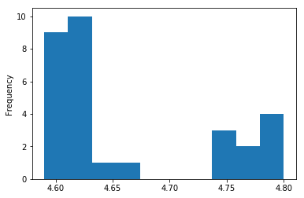
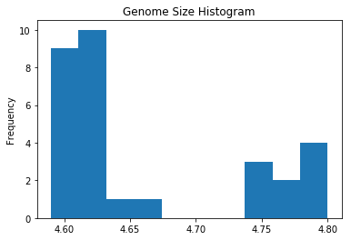
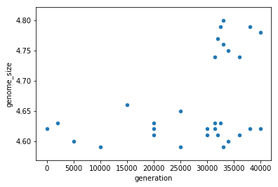
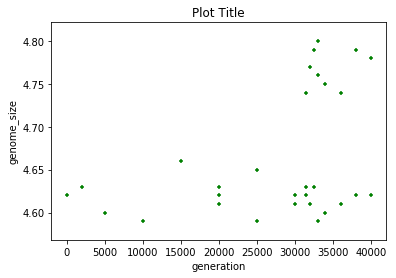
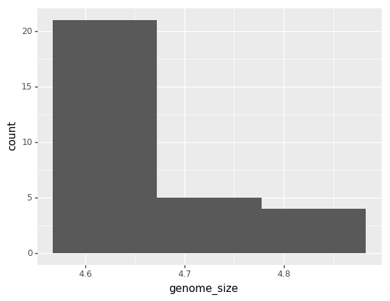
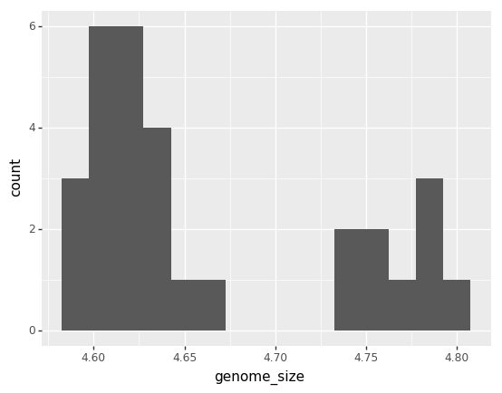
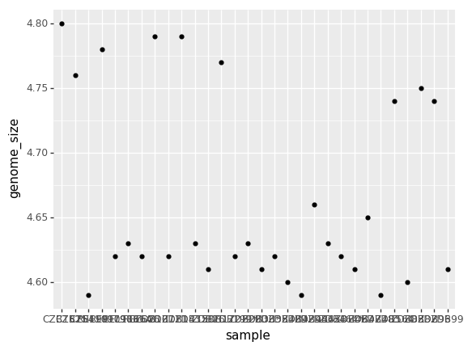
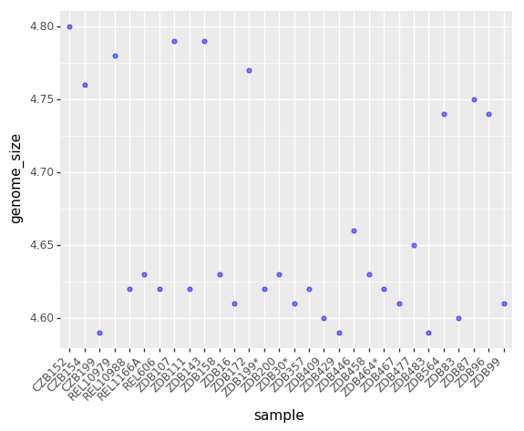
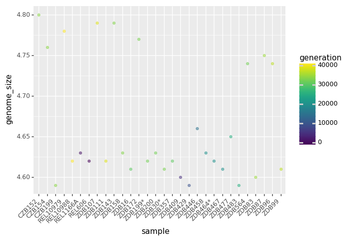

# Visualization in Python

## Matplotlib

<a href="https://matplotlib.org/"></a>

We are going to demonstrate how to the built-in plotting tools that come with Pandas, but these functions essentially "wrap" matplotlib code to produce graphs. Even Plotnine, the ggplot-like library we'll use later, is built on top of matplotlib.


~~~
%matplotlib inline
~~~
{: .language-python }

## Pandas plotting


```python
import pandas as pd
gh_url = 'https://raw.githubusercontent.com/datacarpentry/R-genomics/gh-pages/data/Ecoli_metadata.csv'
ecoli = pd.read_csv(gh_url)
ecoli.head()
```


<div>
<style scoped>
    .dataframe tbody tr th:only-of-type {
        vertical-align: middle;
    }

    .dataframe tbody tr th {
        vertical-align: top;
    }

    .dataframe thead th {
        text-align: right;
    }
</style>
<table border="1" class="dataframe">
  <thead>
    <tr style="text-align: right;">
      <th></th>
      <th>sample</th>
      <th>generation</th>
      <th>clade</th>
      <th>strain</th>
      <th>cit</th>
      <th>run</th>
      <th>genome_size</th>
    </tr>
  </thead>
  <tbody>
    <tr>
      <th>0</th>
      <td>REL606</td>
      <td>0</td>
      <td>NaN</td>
      <td>REL606</td>
      <td>unknown</td>
      <td>NaN</td>
      <td>4.62</td>
    </tr>
    <tr>
      <th>1</th>
      <td>REL1166A</td>
      <td>2000</td>
      <td>unknown</td>
      <td>REL606</td>
      <td>unknown</td>
      <td>SRR098028</td>
      <td>4.63</td>
    </tr>
    <tr>
      <th>2</th>
      <td>ZDB409</td>
      <td>5000</td>
      <td>unknown</td>
      <td>REL606</td>
      <td>unknown</td>
      <td>SRR098281</td>
      <td>4.60</td>
    </tr>
    <tr>
      <th>3</th>
      <td>ZDB429</td>
      <td>10000</td>
      <td>UC</td>
      <td>REL606</td>
      <td>unknown</td>
      <td>SRR098282</td>
      <td>4.59</td>
    </tr>
    <tr>
      <th>4</th>
      <td>ZDB446</td>
      <td>15000</td>
      <td>UC</td>
      <td>REL606</td>
      <td>unknown</td>
      <td>SRR098283</td>
      <td>4.66</td>
    </tr>
  </tbody>
</table>
</div>


### Pandas Histogram

```python
ecoli['genome_size'].plot.hist()
```




```python
ecoli['genome_size'].plot.hist(title='Genome Size Histogram')
```




### Pandas Scatterplot


```python
ecoli.plot.scatter(x='generation',y='genome_size')
```




```python
ecoli.plot.scatter(x='generation',y='genome_size', 
                   title='Plot Title', c='green', marker='+')
```



## Grammar of graphics with plotnine

Python has powerful built-in plotting capabilities such as `matplotlib`, but for
this episode, we will be using the [`plotnine`](https://plotnine.readthedocs.io/en/stable/)
package, which facilitates the creation of highly-informative plots of
structured data based on the R implementation of [`ggplot2`](http://ggplot2.org/)
and [The Grammar of Graphics](http://link.springer.com/book/10.1007%2F0-387-28695-0)
by Leland Wilkinson. The [`plotnine`](https://plotnine.readthedocs.io/en/stable/)
package is built on top of Matplotlib and interacts well with Pandas.

Just as with the other packages, `plotnine` need to be imported. It is good
practice to not just load an entire package such as `from plotnine import *`,
but to use an abbreviation as we used `pd` for Pandas:


```python
import plotnine as p9
```

From now on, the functions of `plotnine` are available using `p9.`. For the
exercise, we will use the `surveys.csv` data set, with the `NA` values removed.

### Plotnine Histogram

```python
(p9.ggplot(data=ecoli,
           mapping=p9.aes(x='genome_size'))
    + p9.geom_histogram()
)
```

    /Users/miketrizna/miniconda3/envs/python36/lib/python3.6/site-packages/plotnine/stats/stat_bin.py:90: UserWarning: 'stat_bin()' using 'bins = 3'. Pick better value with 'binwidth'.
      warn(msg.format(params['bins']))





    <ggplot: (7561237964)>


```python
(p9.ggplot(data=ecoli,
           mapping=p9.aes(x='genome_size'))
    + p9.geom_histogram(bins=15)
)
```





    <ggplot: (7560944062)>

### Plotnine Scatterplot


```python
(p9.ggplot(data=ecoli,
           mapping=p9.aes(x = 'sample', y= 'genome_size'))
 + p9.geom_point()
)
```





    <ggplot: (-9223372029321576718)>


```python
(p9.ggplot(data=ecoli,
           mapping=p9.aes(x = 'sample', y= 'genome_size'))
 + p9.geom_point(alpha=0.5, color='blue')
 + p9.theme(axis_text_x = p9.element_text(angle=45, hjust=1))
)
```





    <ggplot: (-9223372029308153123)>


```python
(p9.ggplot(data=ecoli,
           mapping=p9.aes(x = 'sample', y= 'genome_size', color='generation'))
 + p9.geom_point(alpha=0.5)
 + p9.theme(axis_text_x = p9.element_text(angle=45, hjust=1))
)
```





    <ggplot: (7546764513)>




